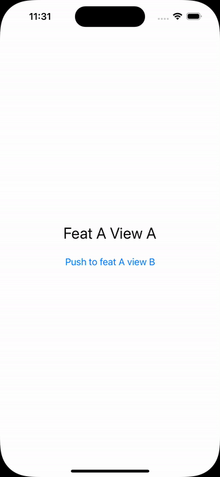

# RouteBlazer
> RouteBlazer is a lightweight SwiftUI navigation library providing ways to easily create and control navigation for more then just a few screen.

[![Swift Version][swift-image]][swift-url]
[![License][license-image]][license-url]
[![Gitmoji][gitmoji-image]][gitmoji-url]

RouteBlazer provides a layer on top of SwiftUI's `NavigationStack` component allowing you to build the navigationPath using various `Router`s that can follow each other, making it easy to split your app into separated features.
Each Router you create will serve as a coordinator for one or more screens.
On top of this, you will also be able to present a new NavigationStack from a Router by simply providing a new Router to present (sheet or fullscreen).



⚠️ - In order to have iOS16 compatibility, this framework doesn't use the Observations framework. Support may be added if requested or submited with a PR.

## Installation

Add this project on your `Package.swift`

```swift
import PackageDescription

let package = Package(
    dependencies: [
        .package(url: "https://github.com/claes34/RouteBlazer", from: "0.1.0")
    ]
)
```

## Basic implementation example

### Routable enum for MyFeature
```swift
enum MyFeatureRoutable: Routable {
  case onboarding
  case main
  case detail(item: Item)

  // Providing a unique id for your Routable is required
  var id: AnyHashable {
    switch self {
    case .onboarding:
      "myFeature.onboarding"
    case .main:
      "myFeature.main"
    case .detail(let item):
      "myFeature.detail_\(item.id)"
    }
  }
}
```

### Router for MyFeature
```swift
final class MyFeatureRouter: Router {
  override var initialNavigationPathItem: NavigationPathItem {
    return .init(route: MyFeatureRoutable.onboarding, viewBuilder: self)
  }
}

extension MyFeatureRouter: RoutableViewBuilder {
  @ViewBuilder
  func buildView(route: any Routable) -> some View {
    switch route as? MyFeatureRoutable {
    case .onboarding:
      MyFeatureOnboardingView(navDelegate: self)
    case .main:
      MyFeatureMainView(navDelegate: self)
    case .detail(let item):
      MyFeatureDetailView(item: item, navDelegate: self)
    case .none:
      Text("Unknown routable \(String(describing: route))")
    }
  }
}

// Using the delegate pattern to handle navigation events from Views.
// The way you want views to communicate to the Router is up to you.
// For example: you could also pass this Router as EnvironmentObject to views or viewModels.
extension MyFeatureRouter: MyFeatureOnboardingNavigationDelegate {
  func onboardingIsDone() {
    // Push a new path item
    push(to: NavigationPathItem(route: MyFeatureRoutable.main, viewBuilder: self))
  }

  func someInteraction() {
    // Push another feature's Router
    push(router: SomeRouter())
    // or
    presentSheet(router: AnotherRouter())
    //
  }

  func anotherInteraction() {
    // Present another Router
  }
}
```

### Setting up a RoutingView
```swift
@main
struct MainApp: App {
  @StateObject var myFeatureRouter = MyFeatureRouter()

  var body: some Scene {
    WindowGroup {
      myFeatureRouter.buildRoutingView()
    }
  }
}
```

## Customize Routing view
In case you need to add features to the RoutingView (ex: setting up custom transitions). You can do so by overriding the `buildRoutingView` method of `Router` like bellow:

```Swift
  @ViewBuilder
  override func buildRoutingView() -> AnyView {
    AnyView(
      ExtendedRoutingView(
        router: self,
        transitionAnimation: .slide.combined(with: .fade(.out))
      )
    )
  }
```

[!TIP]
Checkout [swiftui-navigation-transitions](https://github.com/davdroman/swiftui-navigation-transitions) if you are interested in easily customising transitions.


## Other informations

Developer: Nicolas Fontaine – [LinkedIn](https://www.linkedin.com/in/nfo34/)

Made in Montpellier, south of France, with ❤️

Inspired by the [Routing](https://github.com/obvios/Routing) library from Eric Palma. This library was a good starting point but had an approche that wouldn't suit my needs so I made my own implementation.


Distributed under the MIT license. See ``LICENSE`` for more information.

[https://github.com/claes34/RouteBlazer](https://github.com/claes34/RouteBlazer)

[swift-image]:https://img.shields.io/badge/swift-5.9-orange.svg
[swift-url]: https://swift.org/
[license-image]: https://img.shields.io/badge/License-MIT-blue.svg
[license-url]: LICENSE
[gitmoji-image]: https://img.shields.io/badge/gitmoji-🥰-FFDD67
[gitmoji-url]: https://gitmoji.dev
